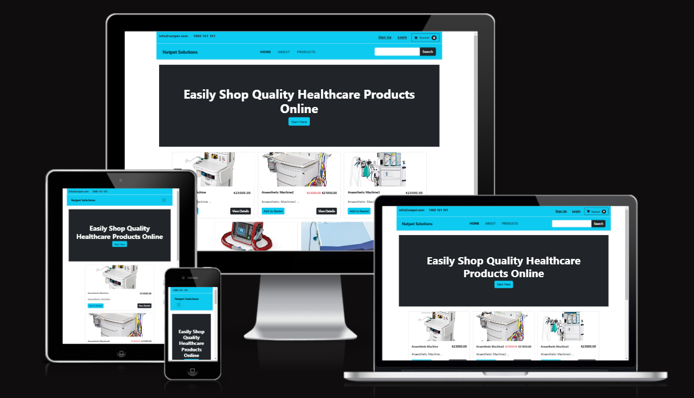
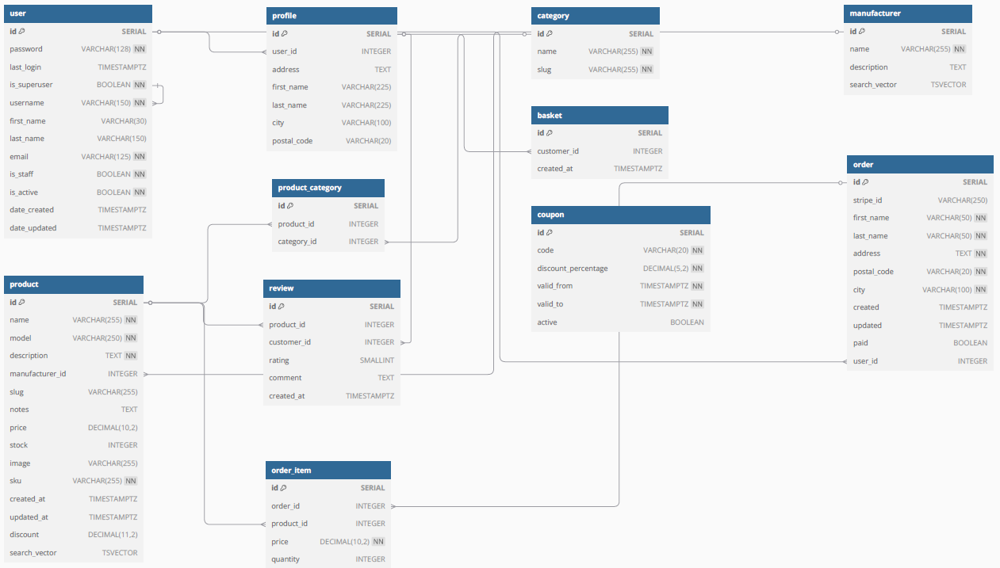

<h1 align="center">Natpet Solutions - Medical Equipment Supplies</h1>

[View the live project here](https://natpet-solutions-559b26bc33e6.herokuapp.com)

This document serves as an introduction to a Django-based e-commerce platform specifically designed for selling medical equipment. The platform aims to provide a seamless shopping experience for healthcare professionals and institutions, offering a wide range of medical devices and supplies. With a focus on user-friendly navigation, secure transactions, and comprehensive product information, this e-commerce solution is tailored to meet the unique needs of the medical industry.

This platform is built using the Django web framework, leveraging its powerful features to create a robust online store dedicated to medical supplies. Our goal is to facilitate the procurement of essential medical equipment for hospitals, clinics, and individual practitioners, ensuring they have access to high-quality products.

## Key Features

- **User-Friendly Interface** : Designed with the end-user in mind, our platform offers intuitive navigation and a clean layout, making it easy for customers to find and purchase the equipment they need.

- **Secure Payment Processing** : We prioritize the security of our users' data. The platform integrates with trusted payment gateways to ensure safe and reliable transactions.

- **Comprehensive Product Catalog** : Our extensive inventory includes a wide variety of medical equipment, complete with detailed descriptions, specifications, and images to assist customers in making informed decisions.

- **Order Management** : Users can easily track their orders, manage returns, and receive updates on their purchases through a streamlined order management system.

- **Responsive Design** : The platform is optimized for both desktop and mobile devices, ensuring a consistent shopping experience across all devices.

The primary goal for this project is to create a fully functional and easy-to-use e-commerce store that allow users to browse a number of different products to add to their shopping bag, so that they can checkout securely using Stripe online payment processing system and complete a purchase.

**Stripe test card:**
  - test card number 4242 4242 4242 4242, 
  - a random three-digit CVC number, 
  - and any expiration date in the future.

Please note: The website is for educational purposes only and uses Stripe test mode to simulate payments.

A user should be able to register to the site and store their personal information, such as default delivery information and view their past order history. They should also be presented with the option to contact store admin and visit Natpet Solution's Facebook business page so that they can stay up to date with all the latest news.

**Relationship Diagrams For DBMS**

The Relationship diagram for the DBMS consists of the following tables: Manufacturer, Category, User, Product, Order, Profile,Basket, Coupon, Review, Order_Item, and Product_Category

## Index – Table of Contents
* [User Experience (UX)](#user-experience-ux) 
* [Features](#features)
* [Design](#design)
* [Planning](#planning)
* [Technologies Used](#technologies-used)
* [Testing](#testing)
* [Deployment](#deployment)
* [Credits](#credits)

## User Experience (UX)

### User stories :

 - #### EPIC Registration and user profile
    - US1. Registration and user account:
      - As a **site user** I can **easily register an account** so that **I have a personal account and able to view my profile**
    - US2. Easily login or logout:
      - As a **site user** I can **easily login or logout** so that **I can access my personal profile account information**
    - US3. Recover password:
      - As a **site user** I can **easily recover my password in case I forget it** so that **I can recover access to my account**
    - US4. Registration confirmation:
      - As a **site user** I can **receive an email confirmation after registration** so that **I can verify that my account registration was successful**
    - US5. Personalized user profile:
      As a **site user** I can **have a personalized user profile** so that **I can view my personal order history and order confirmation and save my payment information**

 - #### EPIC Basket and Products
    - US6. View products to purchase:
      - As a **shopper** I can **view a list of products** so that **I can select some to purchase**
    - US7. View individual product details:
      - As a **shopper** I can **view individual product details** so that **I can identify the price, description, product image and models**
    - US8. Quickly identify deals:
      - As a **shopper** I can **quickly identify deals and special offers** so that **I can take advantage of special saving on product I would like to purchase**
    - US9. View total cost of items in my basket:
      - As a **shopper** I can **easily view the total of my purchases at any time** so that **I can avoid spending too much**
    - US10. Sorting products:
      - As a **shopper** I can **sort a specific category of products** so that **I can find the best priced products in a specific category, or sort the products in that category by name**
    - US11. Searching for a product :
      - As a **shopper** I can **search for a product by name or description** so that **I can find a specific product I would like to purchase**
    - US12. Search results:
      - As a **shopper** I can **easily see what I have searched for and the number of results** so that **I can quickly decide whether the product I want is available**
    - US13. Adding to the basket:
      - As a **shopper** I can **easily select the model and quantity of product when purchasing it** so that **I can ensure I don't make a mistake and select the wrong product model or quantity**

  - #### EPIC Payment
    - US14. Payment:
      - As a **shopper** I can **easily enter my payment details** so that **I can easily pay for the goods after checkout**

  - #### EPIC Adding products to the store
    - US15. Adding products:
      - As a **store owner** I can **add products** so that **I can add new items to my store**
    - US16.  Edit / Update products:
      - As a **store owner** I can **update products** so that **I can change product images, description and prices**

## Features

### Existing Features

#### Header:

[Bootstrap 5.2.3 static CSS & JS](https://getbootstrap.com/docs/5.2/getting-started/download/)

[Bootstrap navbar](https://startbootstrap.com/template/shop-homepage)

[Stripe setup](https://youtu.be/722A27IoQnk?si=72I3lxqKj7FJav0W)

[Stripe setup](https://www.youtube.com/watch?v=cdE7YiBOo_w)

[Bootstrap html snippets](http://bootdey.com)

