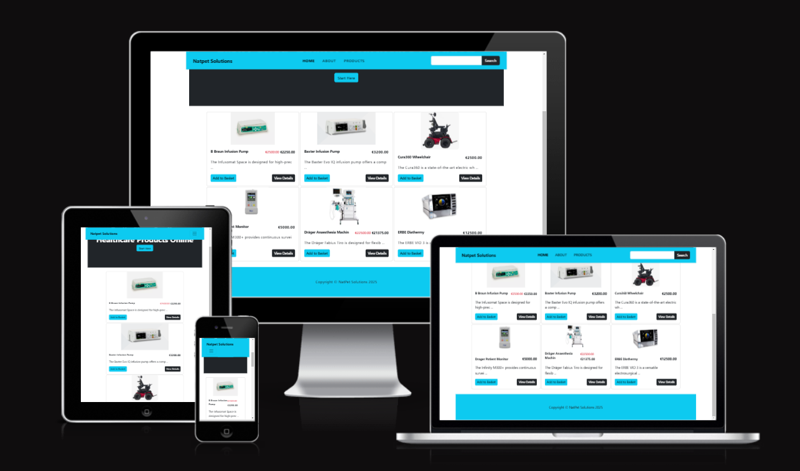

<h1 align="center">Natpet Solutions - Medical Equipment Supplies</h1>

[View the live project here](https://natpet-solutions-559b26bc33e6.herokuapp.com)

This document serves as an introduction to a Django-based e-commerce platform specifically designed for selling medical equipment. The platform aims to provide a seamless shopping experience for healthcare professionals and institutions, offering a wide range of medical devices and supplies. With a focus on user-friendly navigation, secure transactions, and comprehensive product information, this e-commerce solution is tailored to meet the unique needs of the medical industry.

This platform is built using the Django web framework, leveraging its powerful features to create a robust online store dedicated to medical supplies. Our goal is to facilitate the procurement of essential medical equipment for hospitals, clinics, and individual practitioners, ensuring they have access to high-quality products.

## Key Features

- **User-Friendly Interface** : Designed with the end-user in mind, our platform offers intuitive navigation and a clean layout, making it easy for customers to find and purchase the equipment they need.

- **Secure Payment Processing** : We prioritize the security of our users' data. The platform integrates with trusted payment gateways to ensure safe and reliable transactions.

- **Comprehensive Product Catalog** : Our extensive inventory includes a wide variety of medical equipment, complete with detailed descriptions, specifications, and images to assist customers in making informed decisions.

- **Order Management** : Users can easily track their orders, manage returns, and receive updates on their purchases through a streamlined order management system.

- **Responsive Design** : The platform is optimized for both desktop and mobile devices, ensuring a consistent shopping experience across all devices.

The primary goal for this project is to create a fully functional and easy-to-use e-commerce store that allow users to browse a number of different products to add to their shopping bag, so that they can checkout securely using Stripe online payment processing system and complete a purchase.

**Stripe test card:**
  - test card number 4242 4242 4242 4242, 
  - a random three-digit CVC number, 
  - and any expiration date in the future.

Please note: The website is for educational purposes only and uses Stripe test mode to simulate payments.

A user should be able to register to the site and store their personal information, such as default delivery information and view their past order history. They should also be presented with the option to contact store admin and visit Natpet Solution's Facebook business page so that they can stay up to date with all the latest news.

**Relationship Diagrams For DBMS**

The Relationship diagram for the DBMS consists of the following tables: Manufacturer, Category, User, Product, Order, Profile,Basket, Coupon, Review, Order_Item, and Product_Category

## Index – Table of Contents
* [User Experience (UX)](#user-experience-ux) 
* [Features](#features)
* [Design](#design)
* [Planning](#planning)
* [Technologies Used](#technologies-used)
* [Testing](#testing)
* [Deployment](#deployment)
* [Credits](#credits)

## User Experience (UX)

### User stories :

 - #### EPIC Registration and user profile
    - US1. Registration and user account:
      - As a **site user** I can **easily register an account** so that **I have a personal account and able to view my profile**
    - US2. Easily login or logout:
      - As a **site user** I can **easily login or logout** so that **I can access my personal profile account information**
    - US3. Recover password:
      - As a **site user** I can **easily recover my password in case I forget it** so that **I can recover access to my account**
    - US4. Registration confirmation:
      - As a **site user** I can **receive an email confirmation after registration** so that **I can verify that my account registration was successful**
    - US5. Personalized user profile:
      As a **site user** I can **have a personalized user profile** so that **I can view my personal order history and order confirmation and save my payment information**

 - #### EPIC Basket and Products
    - US6. View products to purchase:
      - As a **shopper** I can **view a list of products** so that **I can select some to purchase**
    - US7. View individual product details:
      - As a **shopper** I can **view individual product details** so that **I can identify the price, description, product image and models**
    - US8. Quickly identify deals:
      - As a **shopper** I can **quickly identify deals and special offers** so that **I can take advantage of special saving on product I would like to purchase**
    - US9. View total cost of items in my basket:
      - As a **shopper** I can **easily view the total of my purchases at any time** so that **I can avoid spending too much**
    - US10. Sorting products:
      - As a **shopper** I can **sort a specific category of products** so that **I can find the best priced products in a specific category, or sort the products in that category by name**
    - US11. Searching for a product :
      - As a **shopper** I can **search for a product by name or description** so that **I can find a specific product I would like to purchase**
    - US12. Search results:
      - As a **shopper** I can **easily see what I have searched for and the number of results** so that **I can quickly decide whether the product I want is available**
    - US13. Adding to the basket:
      - As a **shopper** I can **easily select the model and quantity of product when purchasing it** so that **I can ensure I don't make a mistake and select the wrong product model or quantity**

  - #### EPIC Payment
    - US14. Payment:
      - As a **shopper** I can **easily enter my payment details** so that **I can easily pay for the goods after checkout**

  - #### EPIC Adding products to the store
    - US15. Adding products:
      - As a **store owner** I can **add products** so that **I can add new items to my store**
    - US16.  Edit / Update products:
      - As a **store owner** I can **update products** so that **I can change product images, description and prices**

## Features

### Existing Features

-  **F01 Navigation Bar**

      The navigation bar is a crucial element of the e-commerce site, providing users with easy access to various sections. The following features are included namely:
      - **Home :** A link to the homepage showcasing featured products
      - **Product :** A quick access to products
      - **Search Bar :** A prominent search feature enabling users to quickly find specific products.
      - **About :** Information about the company, its mission, and values.
      - **Contact :** Contact information, including email and phone for quick request for equipment full details.
      - **Account :** A user account section for login, registration, order history, and profile management.
      - **Basket :** A quick-access basket icon showing the number of items in the basket.

      Landing Page Navbar

      

      Navbar Full Signed in as Admin

      

      Navbar Full Signed in as User

      

      Navbar Burger Signed-In Menu

      

-  **F02 Landing page image**

      The landing page is user-friendly, visually appealing, and informative, ensuring that visitors can easily navigate through the offerings of the medical equipment supply shop. It aims to establish trust and credibility while providing a seamless shopping experience. The start button service as a quick way for the visitor to view products. 

      

-  **F03 Product page image**

      The product page is a crucial component of this online shopping experience, it presents detailed information about medical equipment, helping customers make informed purchasing decisions. This description covers the essential features and functionalities that should be included in the product detailed view.

      

      Diagnostic Equipment Products Category Page

      

      Life Support Equipment Products Category Page

      

      Patient Care Equipment Products Category Page

      

      Surgical Equipment Products Category Page

      

      Therapeutic Equipment Products Category Page

      

      Infection Control Equipment Products Category Page

      

      Mobility Aids Equipment Products Category Page

      

-  **F04 Sign Up**

      In the digital age, ensuring secure and reliable user registration is crucial for e-commerce platforms, especially in sensitive sectors like medical equipment supply.The focus is on implementing a user registration system that requires both a username and an email address, with mandatory email verification to ensure the authenticity of the user's email before granting access to the platform. By requiring users to confirm their email addresses, the system enhances security and reduces the risk of fraudulent accounts.

      User sign Up

      

      User Verification of their email

      

      Site Admin Verify User

      

-  **F05 Equipment Search**

      In the realm of e-commerce, particularly for specialized sectors like medical equipment supply, the search functionality plays a pivotal role in enhancing user experience and driving sales. The ability to search efficiently allows users to quickly find the products they need, which is crucial in a field where time and precision are paramount. Filtering and Sorting Options: Users can refine their search results based on various parameters such as category, price, and specifications.

      Body Text Search

      

      Filtering by Price

      

      Search by Category

      

-  **F06 Relationship Diagrams For DBMS**

      To support the above search functionality in a Django e-commerce application for a medical equipment supply shop, a well-structured database is essential. Below is a simplified relationship diagram that outlines the key entities and their relationships within the database management system.

      

-  **F07 Django Admin / store owner**

      The Admin add products, create product categories, product description, models, sku, product manufacturers, products images, price and give users permissions.
      **Adding Products**
      - Once logged into the admin interface:
      - **Navigate to the Products section :** Click on "Products" in the admin dashboard.
      - **Add a new product :** Click on the "Add Product" button. Fill in the product details:
        - **Name :** Enter the name of the medical equipment.
        - **Description :** Provide a detailed description of the product.
        - **Model :** Set the model of the product.
        - **Slug :** Generate slug.
        - **Manufacturer :** Set the manufacturer of the product.
        - **Image :** Upload an image of the product.
        - **Price :** Set the price of the product.
        - **SKU :** Set the sku of the product.
        - **Discount :** Set the discount of the product.

      

-  **F08 Footer**

      The footer is a crucial part of the website, serving as a navigational aid and a source of essential information for users. It enhances user experience and builds trust with potential customers by providing easy access to important links and company details. The footer include facebook business page link and Mailchimp subscription

      

-  **F08 Facebook**

      Connecting with customers on social media is essential for engagement. This section include links to:Facebook Business Page

      

-  **F10 Mailchimp**

      Encouraging users to subscribe to a newsletter can help keep them informed about new products, promotions, and company news. This section should include:
      - Email Input Field: A field for users to enter their email address.
      - Subscribe Button: A button to submit the email for subscription.

      

### Features which could be implemented in the future

-   __Search Autocomplete__
    
    Implement a search bar with autocomplete suggestions to help users find products quickly

-   __Detailed Product Descriptions__

    Include specifications, usage instructions, and safety information for each product.

-   __Video Demonstrations__

    Provide video tutorials or demonstrations for complex medical equipment.

-   __Blog and Articles__

    Create a section for informative articles and blog posts about medical equipment, usage tips, and industry news.

-   __Webinars and Workshops__

    Host online webinars or workshops to educate customers on product usage and best practices.

-   __Proposed Features Outcome__
    The proposed features aim to create a robust and user-friendly e-commerce platform for medical equipment supplies. By implementing these enhancements, the shop can improve customer satisfaction, streamline operations, and maintain compliance with industry standards, ultimately leading to increased sales and customer loyalty.

## Design

-   ### Wireframe

      The wireframe showing the landing page and the product page

      

      
Landing Page Wireframes

      
      

      

      
Shop Product Page Wireframes

      
      

## Planning

### User Stories and Kanban board can be accessed here
    
   [User Story](https://github.com/users/RusJamison/projects/3)

## Technologies Used

### Languages Used

-   [HTML5](https://en.wikipedia.org/wiki/HTML5)
-   [CSS3](https://en.wikipedia.org/wiki/Cascading_Style_Sheets)
-   [Jquery](https://jquery.com/)
-   [Python](https://www.python.org/)

### Frameworks, Libraries & Programs Used

-   [Google Fonts:](https://fonts.google.com/) used for the Lato font
-   [Font Awesome:](https://fontawesome.com/) was used to add icons for aesthetic and UX purposes.
-   [Git:](https://git-scm.com/) Version control by utilising the Gitpod terminal to commit to Git and Push to 
           GitHub.
-   [GitHub:](https://github.com/) Respository for the project code after being pushed from Git. 
             GitHub was also used for User Stories (GitHub Issues) and tracking them on a Kanban board.
-   [dbdiagram.io](https://dbdiagram.io/home) Entity Relationship diagrams for the application data model
-   [Amazon Web Services](https://aws.amazon.com//) image storage
-   [Summernote](https://pypi.org/project/django-summernote/) used for reports
-   [Django allauth](https://django-allauth.readthedocs.io/en/latest/index.html) used for account registration and authentication
-   [Django crispy forms](https://django-crispy-forms.readthedocs.io/en/latest/) used for forms
-   [Balsamiq:](https://balsamiq.com/) Create the wireframes during the design process.
-   [Django](https://www.djangoproject.com/) Framework to support rapid and secure development of the application
-   [Bootstrap](https://getbootstrap.com/) Used to build responsive web pages
-   [Gunicorn](https://gunicorn.org/) Assist Web Server to run Django on Heroku
-   [dj_database_url](https://pypi.org/project/dj-database-url/) library for database urls to connect to the Postgres db
-   [psycopg2](https://pypi.org/project/psycopg2/) database adapter used to support Postgres db

## Testing

### Validator Testing 

- [HTML Validator](https://validator.w3.org/)

    - As this project uses Django templates the html has been validated using url

    - Results for validate by URL with errors
      - 

        
Validation URL check - Summary

        
      

    
    - Results for validate by URL with errors cleared
      - 

        
Validation URL check without errors - Summary

        
      

  - [CSS Validator](https://jigsaw.w3.org/css-validator/)

    - Results for validate by URL
      - 

        
Validation URL check - Summary

        
      

    - [Python Validator](https://pep8ci.herokuapp.com/)

  

    
project urls.py validation results

    
  

  

    
project views.py validation results

    
  

  

    
Equipment application urls.py validation results

### Lighthouse Testing

  -   Lighthouse testing results

      

### Previous DJANGO SECRET_KEY
The previously exposed value SECRET_KEY is no longer in use and has been replaced with a new value.

## Deployment

Steps below show how to clone this project repository, configure and deploy the application to Heroku.

### How to Clone the Repository 

- Go to the https://github.com/RusJamison/natpet_solutions repository on Github
- Click the "Code" button and copy the https link
- On the terminal navigate to directory where you want to place the clone

### Create Application and Postgres DB on Heroku

- Log in to Heroku at https://heroku.com
- Click the Create new app button on the Heroku dashboard
- On the Create New App page, enter a unique name for the application and select region.
- Then click Create app, and then click on the Resources tab.
- In the Add-ons search bar enter "Postgres" and select "Heroku Postgres" from the list 
- Then click the "Submit Order Form" button
- Click on Settings on the Application Configuration page and click on the "Reveal Config Vars" button
- Check the DATABASE_URL has been automatically set up
- Add a new Config Var called SECRET_KEY and assign it a value
  - DATABASES = {'default': dj_database_url.parse(os.environ.get('DATABASE_URL'))}

  - SECRET_KEY = os.environ.get('SECRET_KEY')

- Make migration and migrate in VSCode
- Commit and push any local changes to GitHub.
- Make sure the project requirements.txt file is up to date with all necessary supporting files

### Configure Amazon Web Services S3 to host images used by the application

- Click the provided link to sign up for Amazon Web Services.
- Provide name and email address and choose a password
- Open the env.py file and set the value of the Amazon Web Services S3 AWS_ACCESS_KEY_ID, AWS_SECRET_ACCESS_KEY and USE_AWS
- In Heroku click on Settings and click on the "Reveal Config Vars" button.
- Add a new Config Var called 'AWS_ACCESS_KEY_ID' and assign it the value copied from the Amazon Web Services dashboard
- Add a new Config Var called 'AWS_SECRET_ACCESS_KEY' and assign it the value copied from the Amazon Web Services dashboard
- Add a new Config Var called 'USE_AWS' and assign it the boolean value 

### Connect the Heroku app to the GitHub repository

- On Heroku dashboard click on the Deploy tab. 
- Select GitHub as the Deployment Method 
- Enter the name of the github repository you want to deploy
- Choose manual deploy
- The live link for this project is - https://natpet-solutions-559b26bc33e6.herokuapp.com/

- Set DEBUG to False. Git add, commit and push the code to GitHub.
- Ensure requirements.txt is up to date using the command : pip3 freeze --local > requirements.txt
- In the Heroku Config Vars for the application delete this environment variable :  DISABLE_COLLECTSTATIC
- Click on deploy to manual branch

#### The live link to the application can be found here - [Natpet Solutions Medical Equipment Supplies](https://natpet-solutions-559b26bc33e6.herokuapp.com/) 

## Credits

    The Code Institute Learning Platform, Learning Management System (LMS) was the main basis of my codes for this project. A number of my codes is based from the Boutique Ado.

    Thanks to Lewis who took over from Amy Richardson. Thanks for the resources Lewis shared with us.This project ia based on all modules we did during the course of the year so thanks to Amy Richardson for the resources she gave us during the course of the three earlier projects. 

    Thanks to my mentor Brian Macharia for his mentoring sessions, guidance, patience, encouragement and constant motivation throughout the project.

    Thanks to the tutors whom I get help and support during the project. Special mentioning Alan and Rebecca, Sarah for their knowledge sharing skills, patience and quick response.

### Content
-  Special thanks to the following learning platforms I used their resources
   - Udemy
   - Linkedin Learning
   - Coursera

[Bootstrap 5.2.3 static CSS & JS](https://getbootstrap.com/docs/5.2/getting-started/download/)

[Bootstrap navbar](https://startbootstrap.com/template/shop-homepage)

[Stripe setup](https://youtu.be/722A27IoQnk?si=72I3lxqKj7FJav0W)

[Stripe setup](https://www.youtube.com/watch?v=cdE7YiBOo_w)

[Bootstrap html snippets](http://bootdey.com)

   Object Oriented Programming in Python by Estefania Cassingena Navone (https://www.udemy.com/course/python-object-oriented-programming-oop/learn/lecture/12356228?start=150#overview)

    Python Masterclass 2024: Build 24 Real World Python Projects by Ashutosh Pawar (https://www.udemy.com/course/python-masterclass-course/learn/lecture/37365778?start=105#overview)

    100 Days of Code: The Complete Python Pro Bootcamp
    by Dr. Angela Yu (https://www.udemy.com/course/100-days-of-code/learn/lecture/20628484?start=60#overview)

    Python 3: Deep Dive (Part 3 - Dictionaries, Sets, JSON)
    by Dr. Fred Baptiste (https://www.udemy.com/course/python-3-deep-dive-part-3/learn/lecture/12049204?start=615#overview)

    Python Mega Course: Learn Python in 60 Days, Build 20 Apps by Ardit Sulce
    (https://www.udemy.com/course/the-python-mega-course/learn/lecture/34597268?start=240#overview)

    README by Elaine Broche(https://github.com/elainebroche-dev/pf4-wayfarers-guided-hikes)

    Tools for Writing, Sizing, and Validating User Stories including Well-Defined Acceptance Criteria and Gherkin Scenarios
    by Tom and Angela Hathaway (https://www.udemy.com/course/writing-effective-user-stories/learn/lecture/)

    Generate Dynamically PDF files using Python and ReportLab
    by Hugo Ferro (https://www.udemy.com/course/python-reportlab-from-beginner-to-winner/learn)

    Master Python Django 5.0: Learn Django (Core + Advanced Concepts), Behind-the-Scenes, Projects, Boost Career With AI
    by Taranjot Singh (https://www.udemy.com/course/django-complete-course/learn)

    Every Python Programmer Must Have This Skill!!
    by Coding Gears | Train Your Brain (https://www.udemy.com/course/python-unit-testing-fundamentals/learn)

    Take the next step in your Python development by leveraging the power of PostgreSQL and databases!
    by Jose Salvatierra (https://www.udemy.com/course/complete-python-postgresql-database-course/learn)

    Learn the entire technology stack to create beautiful and responsive websites with Python and Django!
    by Jose Portilla (https://www.udemy.com/course/django-and-python-full-stack-developer-masterclass/learn)

    Build 3 stunning websites, learn Back and Front End Web Development, deploy your site with HTML5, CSS3 and Bootstrap 4
    by Nick Walter (https://www.udemy.com/course/django-3-make-websites-with-python-tutorial-beginner-learn-bootstrap/learn/)

    Django Masterclass : Build 9 Real World Django Projects
    by Ashutosh Pawar (https://www.udemy.com/course/django-course/learn/)

    Master Django and Create Python Web Applications in Simple Steps
    by Bharath Thippireddy (https://www.udemy.com/course/django-for-python-developers/learn)

    Learn SQL From Scratch Using MySQL Databases, A Complete SQL Course For Beginners
    by Ashutosh Pawar (https://www.udemy.com/course/sqlcourse/learn/) 

    Master Bootstrap 4 and build 5 real world themes while learning HTML5 semantics & CSS3
    by Brad Traversy (https://www.udemy.com/course/bootstrap-4-from-scratch-with-5-projects/learn)

    Learn Python and build & deploy a real estate application using the Django framework & PostgreSQL
    by Brad Traversy (https://www.udemy.com/course/python-django-dev-to-deployment/learn/)

    Learn the basics of Balsamiq Wireframes, an invaluable tool for creating rapid user interface wireframes.
    by Leon Barnard (https://www.udemy.com/course/getting-started-with-balsamiq-wireframes/learn)

    Unit Testing in Django by Leticia Portella (https://www.linkedin.com/learning/unit-testing-in-django)

    Advanced Django Project: Build High-Traffic Websites with Django by Ryan Mitchell (https://www.linkedin.com/learning/advanced-django-project-build-high-traffic-websites-with-django)

    Django Essential Training by Leticia Portella (https://www.linkedin.com/learning/django-essential-training) 

    Full Stack Web Development with Flask by Christian Hur (https://www.linkedin.com/learning/full-stack-web-development-with-flask)

    Learning Django by  Caleb Smith (https://www.linkedin.com/learning/learning-django-2)

    Start the UX Design Process: Empathize, Define, and Ideate by Google (https://www.coursera.org/learn/start-ux-design-process)

    Django Web Framework by Meta (https://www.coursera.org/learn/django-web-framework/)

    Back-End Developer Capstone by Meta (https://www.coursera.org/learn/back-end-developer-capstone)

    Building Web Applications in Django by University of Michigan (https://www.coursera.org/learn/django-build-web-apps)

    Python Functions, Files, and Dictionaries by University of Michigan (https://www.coursera.org/learn/python-functions-files-dictionaries)

    The Power of Object-Oriented Programming by University of Michigan (https://www.coursera.org/learn/the-power-of-object-oriented-programming) 

    (https://www.pexels.com/) 

